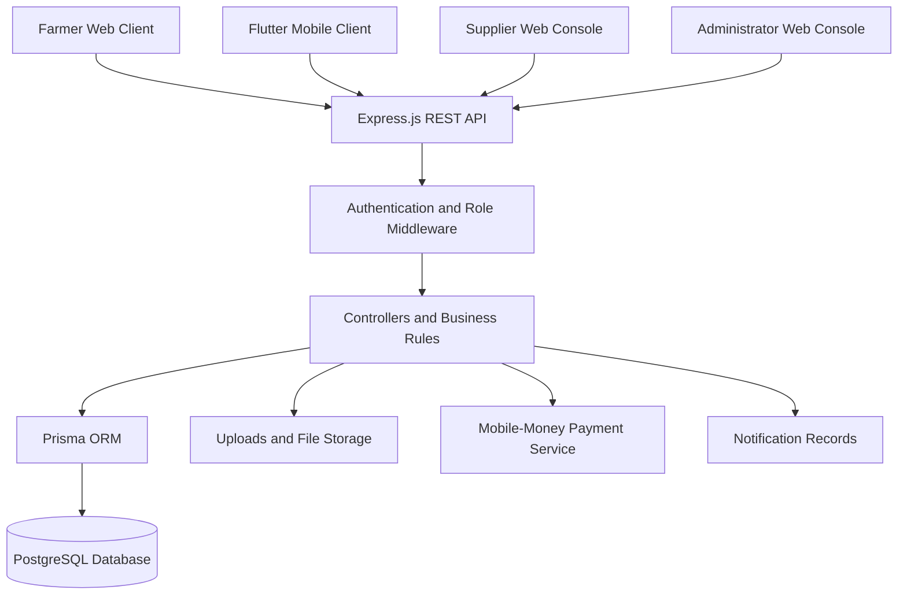

# CHAPTER III: METHODOLOGY

## 3.1 Introduction

This chapter presents the methodology used to analyse, design, develop, and validate the proposed AgriConnect Market system. AgriConnect Market is a digital agricultural marketplace that connects farmers with verified suppliers of farm inputs such as seeds, fertilizers, pesticides, irrigation equipment, animal feed, and farm tools. The system is implemented through a web application, a mobile application, and a centralized backend service supported by a PostgreSQL database.

The chapter describes the system overview, major system features, architecture, hardware and software requirements, functional and non-functional requirements, feasibility study, UML documentation approach, and database design. The purpose of this chapter is to show how the proposed system translates the research objectives into a functional, secure, and maintainable software solution.

The development process followed an iterative and incremental approach. The marketplace, authentication, product catalogue, ordering, payment, supplier management, administration, finance, refund, notification, and review functions were developed as related modules. Each module was connected to the central API and tested through the relevant web or mobile workflow. This approach made it possible to refine the system progressively while preserving a single source of truth for users, products, orders, payments, and transactions.

## 3.2 System Overview

AgriConnect Market is a multi-role agricultural e-commerce and marketplace system. It provides a common digital platform through which farmers can browse agricultural products, compare suppliers, place orders, make payments, track order progress, and submit reviews or complaints. Verified suppliers can register their businesses, submit verification information, manage products and stock, view orders associated with their products, update fulfilment status, inspect payment and refund transactions, and monitor their financial performance. Administrators supervise the entire platform and manage users, supplier verification, products, orders, refunds, transactions, inventory, reviews, settings, and notifications.

The system consists of the following major clients and services:

1. **Web application:** A React-based responsive application built with Vite. It provides the public marketplace, farmer shopping workflows, administrator dashboard, and supplier dashboard.
2. **Mobile application:** A Flutter client that provides mobile access to the catalogue, suppliers, product details, cart, checkout, user profile, authentication, and order-related workflows. The mobile client communicates with the same backend API used by the web application.
3. **Backend API:** An Express.js service that implements authentication, authorization, product management, order processing, payment records, refunds, transactions, reviews, disputes, notifications, supplier operations, coupons, and administrative operations.
4. **Database:** A PostgreSQL database accessed through Prisma ORM. The database stores the persistent system records and enforces relationships between users, products, orders, payments, refunds, reviews, disputes, notifications, inventory logs, and transactions.
5. **File storage:** The backend serves uploaded profile photos, supplier verification documents, product images, and payment proof files from the uploads directory.

The system follows a centralized service model. The web and mobile applications do not directly access the database. Instead, they send authenticated HTTP requests to the backend API. The backend validates the request, checks the user role, applies the business rules, updates the database, and returns a structured response to the client. This design improves consistency because both clients use the same authentication, order, payment, and inventory rules.

### 3.2.1 System Actors

The primary actors in the system are:

- **Farmer or customer:** Browses products, views suppliers, adds products to the cart, checks out, views orders, cancels eligible orders, requests returns or complaints, submits reviews, and receives notifications.
- **Supplier:** Registers a supplier business, provides verification information, creates and manages agricultural products, monitors stock, views only orders containing the supplier's products, updates order status, processes complaints according to authorization, views payment and refund transactions, and monitors supplier finance.
- **Administrator:** Manages the whole platform, approves or rejects supplier verification, manages user accounts, manages products and inventory, monitors all orders, confirms refunds, reviews transactions and financial reports, moderates reviews, manages disputes, and updates store settings.
- **Payment service:** Represents the external mobile-money payment provider used by the backend when a live mobile payment is initiated. The backend records the payment result and creates a transaction record.
- **Database system:** Stores and retrieves the persistent data required by the application. It is a supporting system actor rather than a human user.

### 3.2.2 System Boundary

The system boundary includes authentication, marketplace browsing, product and supplier management, order processing, payment recording, transaction reporting, refund management, notifications, reviews, disputes, coupons, inventory, and administrative dashboards. External mobile-money processing is outside the internal database boundary, but its response is received and validated by the backend before an order is accepted as paid.

## 3.3 System Features

### 3.3.1 User Registration, Authentication, and Profile Management

The system allows users to register using their name, email, and password. Authentication is implemented through the backend authentication routes, while protected resources require a valid authentication token. The system also supports login, logout, profile retrieval, profile updates, one-time password verification, and password recovery. Profile photos can be uploaded and stored by the backend.

A supplier registration includes additional business information such as the supplier business name, supplier licence number, and verification document. The administrator can review the supplier verification status and approve, reject, or update the supplier account. This feature supports trust and accountability in the agricultural marketplace.

### 3.3.2 Product Catalogue and Search

The catalogue allows farmers to browse available agricultural products. Each product contains a name, description, price, category, images, stock values, unit, and supplier association. The supported product categories include seeds, fertilizers, pesticides, farm tools, irrigation equipment, animal feed, and other agricultural products.

The product catalogue is available to both web and mobile users through the public product API. Product details include supplier attribution, making it possible for customers to identify the supplier responsible for a listed item. Suppliers and administrators can create, update, and delete products according to their roles. Product image uploads are handled by the backend.

### 3.3.3 Supplier Discovery and Supplier Profiles

Farmers can browse public supplier profiles and open a detailed supplier page. Supplier information can include the supplier name, business name, profile photo, delivery address, product listings, verification information, ratings, and reviews. The supplier directory improves transparency by allowing customers to compare verified agricultural vendors before purchasing.

### 3.3.4 Shopping Cart and Checkout

The shopping cart allows a customer to select products and quantities before checkout. The checkout workflow collects the delivery address, payment method, optional last-four-digit or mobile payment information, comment, and coupon code where applicable. The backend validates the order items and calculates the final total after applying a valid percentage or fixed discount.

The system is configured to support full order payment. Payment information is stored in the Payment entity when the payment is successfully approved. A corresponding Transaction record is created for the payment so that the event can be displayed in administrative and supplier financial reports.

### 3.3.5 Order Management and Order Tracking

After checkout, the customer can view personal orders and open an individual order detail page. An order contains the customer, delivery address, total amount, discount amount, payment method, payment status, comment, order items, and current order status.

The order status model supports pending, confirmed, processing, shipped, delivered, cancelled, return pending, returned, and other operational states required by the fulfilment workflow. Administrators can view and update all orders. Suppliers can view only orders that contain products belonging to their supplier account. This supplier-level filtering prevents one supplier from accessing another supplier's orders.

A supplier order card displays the customer, order identifier, order items, delivery destination, payment method, current status, order amount, and transaction activity. Cancelled orders belonging to the supplier remain visible so that the supplier can identify the cancellation and review the related refund status and transaction record.

### 3.3.6 Payment and Transaction Management

Payment records and transaction records are separate but related concepts in the system. A Payment record stores the payment event associated with an order, including payment type, payment method, amount, status, phone number, payment information, and collection information. A Transaction record provides a general financial ledger entry with a transaction type, amount, description, status, optional order identifier, metadata, and creation date.

The system records payment transactions when an order payment is completed. It records refund transactions when a cancellation or refund is completed. The administrative finance screen presents gross revenue, confirmed refunds, net revenue, monthly revenue trends, and recent transactions. The supplier dashboard presents payment transactions, refund transactions, net revenue, monthly payment performance, and transactions belonging only to the supplier's orders.

### 3.3.7 Cancellation, Return, Refund, and Dispute Handling

A customer can cancel an order only when the order is at an eligible stage. When an order is cancelled, the system changes the order status to `CANCELLED` and creates or updates the associated refund record. The refund record stores the amount, status, refund type, reason, payment count, requester, confirmer, confirmation date, and stock restoration information.

A completed full refund restores the quantity of the ordered products to stock. When a refund is confirmed, the backend creates one completed refund transaction for the order. Duplicate refund transactions are prevented by checking whether a refund transaction already exists for that order. This ensures that financial reports remain accurate.

Customers may submit complaints or return requests according to the order state. A dispute contains the order, customer, dispute type, description, evidence URL, status, resolution note, reviewer, and review date. Administrators or authorized suppliers can resolve eligible complaints using the available resolution workflow.

### 3.3.8 Supplier Product and Inventory Management

Suppliers can manage their own product listings. They can create a product, update product details and images, delete a product, and monitor stock quantities. Administrators can manage all products and maintain inventory logs. Inventory logs record stock-in, stock-out, damaged, and returned quantities, together with an optional note and timestamp.

The low-stock functionality counts products whose stock quantity is at or below the configured threshold. This gives suppliers and administrators an operational indicator that helps them restock products before they become unavailable.

### 3.3.9 Administrator Dashboard and Management Console

The administrator dashboard provides a consolidated view of platform operations. It includes total revenue, total orders, farmer accounts, supplier accounts, verified suppliers, products, open disputes, pending complaints, order status distribution, revenue trends, platform composition, and recent transactions.

The administrator navigation includes overview, catalogue, customers, orders, reviews, finance, cancelled orders/refunds, inventory, and settings. Administrative access is protected by role-based middleware, which prevents farmers and suppliers from accessing administrator routes.

### 3.3.10 Supplier Dashboard and Supplier Console

The supplier dashboard provides information specific to the logged-in supplier. It includes total products, low-stock products, total orders containing the supplier's products, pending orders, gross payment revenue, refund totals, net revenue, monthly payment trend, and recent transactions.

The supplier console includes overview, products, orders, and profile modules. Supplier orders are displayed as cards rather than an unstructured table. The cards use the system green visual language and display order status, order value, customer information, product items, payment information, transaction activity, complaints, refunds, and available actions.

### 3.3.11 Reviews and Ratings

Customers can submit reviews for products and suppliers. Each review contains the customer, rating, comment, target type, product or supplier identifier, approval status, moderator, and moderation date. Administrators can approve or delete reviews. Public product and supplier pages display approved review information to support informed purchasing decisions.

### 3.3.12 Coupons and Discounts

Administrators can create and manage coupons. A coupon may use a percentage discount or a fixed discount. The system validates the coupon's active state, validity dates, minimum order amount, usage limit, and current usage count before applying it to an order. The order stores the coupon association and the calculated discount amount.

### 3.3.13 Notifications

The notification module stores user-specific notifications such as order creation, cancellation, refund, and operational updates. Each notification has a type, channel, message, status, creation date, and optional sent date. Authenticated users can retrieve their notifications and mark individual or all notifications as read.

The web administrator and supplier layouts include a notification bell. The bell displays the number of unread notifications and provides a notification list. The client refreshes notification data periodically so that recent order and financial events become visible without requiring a full page reload.

## 3.4 System Architecture

### 3.4.1 Architectural Style

AgriConnect Market uses a layered client-server architecture with a centralized RESTful backend. The architecture is divided into the presentation layer, application/API layer, business logic and security layer, data access layer, and database/storage layer.

The presentation layer consists of the React web application and Flutter mobile application. The API layer is implemented with Express.js. Controllers implement application operations, route modules define endpoint paths, and middleware handles authentication and role authorization. Prisma provides the database access layer for the PostgreSQL database.

### 3.4.2 Architectural Layers

1. **Presentation layer:** React pages, React components, React Query data fetching, Zustand authentication/cart stores, Flutter views, Flutter providers, and Flutter navigation.
2. **API and routing layer:** Express route modules for authentication, products, orders, administration, refunds, finance, coupons, disputes, reviews, notifications, and suppliers.
3. **Business logic layer:** Controllers validate input, calculate order totals, verify coupons, process payments, update order status, enforce supplier ownership, create transaction records, restore stock, and create notifications.
4. **Security layer:** Authentication middleware verifies the user identity, while role middleware restricts administrator and supplier operations. Protected API requests use bearer tokens and/or authentication cookies.
5. **Data access layer:** Prisma Client translates application queries into PostgreSQL operations and manages relationships, filters, aggregation, and transaction-related persistence.
6. **Persistence and file layer:** PostgreSQL stores structured entities. The uploads directory stores profile photos, supplier verification documents, product media, and payment proof files.

### 3.4.3 Main Data Flow

The main order data flow is as follows:

1. The customer selects products using the web or mobile client.
2. The client sends the order payload to the protected order endpoint.
3. The backend authenticates the customer and validates the items, prices, coupon, delivery address, and payment data.
4. The backend optionally communicates with the mobile-money payment service.
5. The order, order items, payment record, transaction record, and notification are stored.
6. The client receives the created order and displays the order status.
7. Suppliers retrieve orders through a supplier-scoped endpoint that filters orders by product ownership.
8. Administrators retrieve platform-wide order and transaction information through protected administrative endpoints.
9. When cancellation or refund occurs, the backend updates the order and refund, restores stock where necessary, creates a refund transaction, and sends notifications.

### 3.4.4 System Architecture Figure

**Insert image here:** Figure 3.1: AgriConnect Market System Architecture.

The architecture figure should show the Farmer/Web Client, Flutter Mobile Client, Supplier Console, Administrator Console, Express.js REST API, authentication and role middleware, application controllers, Prisma ORM, PostgreSQL database, file storage, and external mobile-money payment service. Arrows should show requests from clients to the API and data flow from the API to the database and supporting services.

A simplified representation of the architecture is shown below and can be converted into a graphical figure for the final thesis:

## 3.5 System Requirements

The system requirements define the physical and software resources needed to develop, test, deploy, and use AgriConnect Market. The requirements are divided into hardware requirements and software requirements.

### 3.5.1 Hardware Requirements

The following hardware requirements are recommended for development and testing:

| Hardware component | Minimum requirement | Recommended requirement | Purpose |
|---|---|---|---|
| Development computer | Dual-core processor, 4 GB RAM, 20 GB free storage | Core i5/Ryzen 5 or better, 8-16 GB RAM, SSD storage | Running the code editor, backend, frontend, database tools, and emulator |
| Mobile testing device | Android device with 2 GB RAM | Android device with 4 GB RAM or higher | Testing the Flutter application and mobile user interface |
| Network connection | Stable 3G/4G connection | Stable broadband or Wi-Fi connection | API communication, package installation, payment integration, and file upload |
| Server or deployment environment | 1 vCPU, 1 GB RAM, 10 GB storage | 2 or more vCPU, 4 GB RAM, SSD storage | Hosting the backend, uploads, and database connection |
| Database storage | PostgreSQL-compatible storage | Managed PostgreSQL with backup support | Persisting application data and transaction history |

The exact hardware requirements may vary depending on the number of concurrent users, product images, transaction volume, and deployment provider. The recommended configuration is sufficient for development, demonstration, and small to medium-scale deployment.

### 3.5.2 Software Requirements

The system uses the following software and technologies:

- **Development tools:** Visual Studio Code, Android Studio or Flutter-compatible Android tooling, Git, pnpm, Prisma CLI, and PostgreSQL administration tools.
- **Programming languages:** JavaScript with ECMAScript modules for the backend and web application; Dart for the Flutter mobile application; Prisma Schema Language for database modelling; HTML and CSS for web presentation.
- **Database:** PostgreSQL accessed through Prisma ORM and Prisma Client.
- **Web framework and libraries:** React, React Router, Vite, TanStack React Query, Zustand, Axios, Recharts, Lucide React, React Icons, React Hot Toast, Express.js, CORS, Cookie Parser, Multer, JSON Web Token support, Bcrypt, Nodemailer, and PostgreSQL drivers.
- **Mobile framework and libraries:** Flutter, Dart, Provider, HTTP, Shared Preferences, Google Fonts, Lucide Icons, and Cached Network Image.
- **Backend tools:** Node.js, Express.js, Prisma, Multer for file uploads, Bcrypt for password hashing, JSON Web Token support for authentication, and Nodemailer for email-related workflows.
- **Operating systems:** Windows, macOS, or Linux for development; Android for mobile deployment and testing; and a Linux-compatible server environment for production backend deployment.
- **Browser requirements:** A modern browser such as Google Chrome, Microsoft Edge, Mozilla Firefox, or Safari with JavaScript enabled.

## 3.6 Requirements

### 3.6.1 Functional Requirements

The functional requirements define what the system must do. Each requirement is labelled so that it can be tested and traced to the corresponding feature.

| ID | Functional requirement | Description and acceptance condition |
|---|---|---|
| R1 | User registration | The system shall allow a farmer or supplier to create an account using valid registration details. The account shall not be created when required fields are missing or invalid. |
| R2 | User login | The system shall authenticate a registered user and return a valid authenticated session or token when the email and password are correct. |
| R3 | OTP and password recovery | The system shall support OTP verification and password recovery for eligible user accounts. |
| R4 | Profile management | An authenticated user shall be able to view and update profile information. Suppliers shall be able to submit business and verification information. |
| R5 | Product browsing | The system shall display available agricultural products with their names, descriptions, prices, categories, images, stock information, and supplier information. |
| R6 | Product search and filtering | The system shall allow users to locate products by catalogue information and category. |
| R7 | Supplier browsing | The system shall display public supplier profiles, products, verification information, ratings, and reviews where available. |
| R8 | Cart management | The system shall allow a customer to add products, modify quantities, remove items, and view the calculated cart total. |
| R9 | Checkout | The system shall collect delivery and payment information and create an order only when the order items and required information are valid. |
| R10 | Coupon validation | The system shall validate coupon activity, dates, minimum order amount, usage limit, and discount type before applying a coupon. |
| R11 | Payment processing | The system shall support the configured payment methods, record successful payments, and reject failed payment attempts. |
| R12 | Order creation | The system shall create an order containing the customer, delivery address, amount, discount, status, and order items. |
| R13 | Customer order history | An authenticated customer shall be able to view only their own orders and order details. |
| R14 | Order status management | Authorized administrators and suppliers shall be able to update order status according to their access scope. |
| R15 | Order cancellation | The system shall allow cancellation only for eligible orders and shall record the cancellation event. |
| R16 | Refund management | The system shall create, update, confirm, and display refund records for cancelled or returned orders. |
| R17 | Refund transaction recording | The system shall create one completed refund transaction after a refund is confirmed and shall prevent duplicate refund transactions for the same order. |
| R18 | Supplier order isolation | A supplier shall view and manage only orders containing products owned by that supplier. |
| R19 | Supplier finance | A supplier shall view payment transactions, refund transactions, gross revenue, refunds, net revenue, and recent transaction activity for the supplier's orders. |
| R20 | Administrator finance | An administrator shall view all platform transactions, revenue, refunds, net financial information, and transaction trends. |
| R21 | Inventory management | Authorized users shall manage product stock and record stock-in, stock-out, damaged, and returned inventory activities. |
| R22 | Low-stock monitoring | The system shall identify products whose quantity is equal to or below the configured low-stock threshold. |
| R23 | Reviews and ratings | Customers shall submit product or supplier reviews, and administrators shall approve or remove reviews. |
| R24 | Disputes and complaints | Customers shall submit eligible complaints or disputes, and authorized users shall review and resolve them. |
| R25 | Notifications | The system shall create and display user-specific notifications for relevant order, payment, refund, and operational events. |
| R26 | Notification status | An authenticated user shall be able to mark an individual notification or all pending notifications as read. |
| R27 | Administrator user management | An administrator shall view, update, activate, delete, and manage user roles and supplier verification information. |
| R28 | Store settings | An administrator shall view and update store name, logo, contact information, address, and currency settings. |
| R29 | File uploads | The system shall support profile photos, supplier verification documents, product images, and payment proof uploads in their designated storage paths. |
| R30 | Mobile access | The Flutter mobile client shall provide authentication, product browsing, supplier browsing, cart, checkout, profile, and order-related access through the backend API. |

### 3.6.2 Non-Functional Requirements

The non-functional requirements define system quality attributes and constraints.

| ID | Category | Non-functional requirement |
|---|---|---|
| NFR1 | Performance | Common catalogue and dashboard requests should return within an acceptable response time under normal network and development load. |
| NFR2 | Performance | Dashboard data should be refreshed periodically and should update after important order, refund, or transaction mutations. |
| NFR3 | Usability | The web interface shall provide clear navigation for farmers, suppliers, and administrators, with role-specific screens and understandable status labels. |
| NFR4 | Usability | The web interface shall be responsive and usable on desktop, tablet, and mobile browser sizes. |
| NFR5 | Usability | The mobile application shall provide touch-friendly navigation through a bottom navigation structure for home, catalogue, suppliers, cart, and profile. |
| NFR6 | Security | Protected API routes shall require authentication, and administrator and supplier routes shall enforce role-based access control. |
| NFR7 | Security | Passwords shall be stored using a password-hashing mechanism rather than plain text. |
| NFR8 | Security | A supplier shall not be able to access or modify another supplier's orders, products, or financial transactions. |
| NFR9 | Security | Customers shall not be able to access another customer's order details. |
| NFR10 | Security | Uploaded files shall be stored in controlled upload directories and served through the backend upload path. |
| NFR11 | Reliability | Order, payment, refund, and transaction records shall remain persistent after a client session ends. |
| NFR12 | Reliability | A failed payment or invalid request shall return an error without creating an incomplete successful order transaction. |
| NFR13 | Data integrity | Orders shall be associated with valid users and order items, and refunds shall be associated with one order. |
| NFR14 | Data integrity | A full refund shall restore stock only when the stock-restoration condition has not already been completed. |
| NFR15 | Maintainability | The system shall separate routes, controllers, middleware, database access, frontend pages, components, stores, and mobile providers. |
| NFR16 | Scalability | The application shall support future expansion of product categories, suppliers, payment methods, mobile features, and reporting modules. |
| NFR17 | Portability | The web client shall run in modern browsers, and the mobile client shall target supported Flutter mobile platforms. |
| NFR18 | Availability | The backend shall expose a health response and remain available when the database and required environment variables are correctly configured. |
| NFR19 | Compatibility | The web and mobile clients shall use the same backend data contracts for products, suppliers, orders, reviews, and authentication. |
| NFR20 | Auditability | Payment, refund, inventory, review, dispute, notification, and transaction records shall include timestamps and relevant status information. |

## 3.7 Feasibility Study

### 3.7.1 Technical Feasibility

The system is technically feasible because it uses established and widely supported technologies. React and Vite provide a suitable web development environment, while Flutter provides a cross-platform mobile application framework. Express.js is appropriate for building RESTful APIs, and Prisma provides a structured database access layer for PostgreSQL. The project already separates frontend, backend, mobile, database schema, routes, controllers, providers, and services, which supports modular development.

The application can be developed and tested using commonly available development computers. The use of REST APIs allows the web and mobile clients to share the same backend business rules. File uploads are handled through Multer, passwords are protected through hashing, and protected routes use authentication middleware. These technologies are sufficient for the scope of a final-year project and can support future deployment to cloud hosting and managed PostgreSQL services.

### 3.7.2 Economic Feasibility

The system is economically feasible because the principal development tools and frameworks are open source or freely available for educational use. React, Vite, Flutter, Express.js, Prisma, PostgreSQL, Node.js, and Visual Studio Code do not require expensive commercial licences for the proposed project.

The main possible costs include internet access, hosting, database hosting, domain registration, email delivery, file storage, and external mobile-money service charges. During development, the system can run locally, which reduces infrastructure cost. The expected benefits include improved access to agricultural inputs, increased supplier visibility, better order tracking, reduced manual record keeping, clearer transaction reporting, and more organized supplier and administrator operations.

### 3.7.3 Operational Feasibility

The system is operationally feasible because it reflects the normal activities of an agricultural marketplace. Farmers can search and purchase products through familiar shopping and checkout interactions. Suppliers can manage their products and view orders associated with their own inventory. Administrators can control verification, users, orders, inventory, finance, refunds, reviews, and settings from a dedicated dashboard.

The role-based design reduces complexity for each user because users see functions related to their responsibilities. The responsive web application supports browser-based access, while the Flutter application supports mobile access. Clear order statuses, notification records, transaction summaries, and supplier cards improve the ability of users to understand the current state of their activities.

### 3.7.4 Schedule Feasibility

The project is schedule-feasible because it is divided into independent but connected modules. A practical implementation sequence is:

1. Requirements analysis and system planning.
2. Database schema and backend project configuration.
3. Authentication and user role management.
4. Product catalogue and supplier management.
5. Cart, checkout, payment, and order processing.
6. Supplier and administrator dashboards.
7. Refunds, transactions, inventory, reviews, disputes, and notifications.
8. Flutter mobile integration.
9. Integration testing, usability testing, documentation, and deployment preparation.

The incremental approach allows completed modules to be tested while other modules are still being developed. This reduces the risk of leaving all integration work until the end of the project.

## 3.8 UML Diagrams

The UML diagrams for AgriConnect Market shall be created, labelled, and placed in the Appendix section as required by the university guideline. The main chapter should describe the purpose of each diagram and refer readers to the corresponding appendix figure rather than placing all diagrams in the body of the chapter.

### 3.8.1 Use Case Diagram

The use case diagram shall show the Farmer, Supplier, Administrator, Payment Service, and Database or system boundary actors. Major use cases shall include register, login, browse products, browse suppliers, manage cart, checkout, make payment, view orders, cancel order, submit review, submit dispute, receive notification, manage products, manage stock, view supplier transactions, view supplier finance, manage users, approve suppliers, manage orders, process refunds, view platform transactions, manage reviews, and manage store settings.

The use case diagram should show that the Farmer interacts with the public marketplace and personal order functions, the Supplier interacts with supplier-owned products and orders, and the Administrator interacts with platform-wide management functions. The Payment Service should be connected to the payment use case. Refer to **Appendix Figure A1: AgriConnect Market Use Case Diagram**.

### 3.8.2 Activity Diagram

The activity diagram should describe the customer order process. The activity begins when the customer browses products, adds items to the cart, enters delivery information, selects a payment method, and submits checkout. The system validates the cart and coupon. If payment fails, the system displays an error and does not complete the successful payment flow. If payment succeeds, the system creates the order, payment record, transaction record, and notification, after which the customer can view the order status. Refer to **Appendix Figure A2: Customer Order and Payment Activity Diagram**.

A second activity diagram may describe cancellation and refund processing, including eligibility validation, order cancellation, refund status determination, stock restoration, refund transaction creation, and notification. Refer to **Appendix Figure A3: Order Cancellation and Refund Activity Diagram**.

### 3.8.3 Sequence Diagram

The order sequence diagram should show messages between the Farmer Client, Backend API, Authentication Middleware, Order Controller, Payment Service, Prisma Client, PostgreSQL Database, and Notification Service. It should show authentication, item validation, payment response, order creation, transaction creation, and response delivery. Refer to **Appendix Figure A4: Order Checkout Sequence Diagram**.

The supplier transaction sequence diagram should show the Supplier Client requesting supplier orders, the API verifying supplier identity, filtering order items by supplier ownership, retrieving transactions, and returning supplier-scoped cards and finance data. Refer to **Appendix Figure A5: Supplier Order and Transaction Sequence Diagram**.

### 3.8.4 Class or Domain Model Diagram

The domain model diagram should represent the major entities: User, Address, Product, Coupon, Order, OrderItem, Payment, Refund, Transaction, InventoryLog, Review, Dispute, Notification, and StoreSettings. It should show primary relationships such as one user having many orders, one order having many order items, one product belonging to an optional supplier, one order having many payments, one order having at most one refund, and one order being associated with many transaction records through its order identifier. Refer to **Appendix Figure A6: AgriConnect Market Domain Model Diagram**.

### 3.8.5 Database Schema Diagram

The database schema diagram shall be placed in the Appendix and referenced from Section 3.9. It should show the tables, primary keys, foreign keys, relationship cardinalities, and important indexes. Refer to **Appendix Figure A7: Database Schema Diagram**.

## 3.9 Database Design

### 3.9.1 Database Design Overview

AgriConnect Market uses PostgreSQL as its relational database management system. Prisma Schema is used to define the database models, enumerations, relationships, defaults, indexes, and constraints. The database is designed to persist identity data, product data, marketplace transactions, operational records, and reporting records.

The logical design separates users, products, orders, payments, refunds, and transactions so that each concept can be managed independently. The physical design uses UUID strings as primary keys for the principal entities. Date and time fields are recorded using DateTime values, while financial amounts use numeric application values represented as floating-point fields in the current schema. Indexes are defined on frequently filtered fields such as user identifiers, order status, product category, supplier identifiers, coupon codes, refund status, dispute status, and notification status.

### 3.9.2 Main Entities and Attributes

| Entity | Primary key | Important attributes | Purpose |
|---|---|---|---|
| User | `id` | name, email, password, role, phoneNumber, business details, verificationStatus, createdAt | Stores farmers, suppliers, and administrators |
| Address | `id` | userId, label, line1, line2, city, region, country, postalCode, isDefault | Stores reusable customer delivery addresses |
| Product | `id` | name, description, price, stock, stockQuantity, unit, images, category, supplierId | Stores agricultural products listed in the marketplace |
| Coupon | `id` | code, discountType, value, validity dates, usageLimit, usageCount, createdById | Stores discount and promotional rules |
| Order | `id` | userId, totalAmount, discountAmount, status, shippingAddress, paymentMethod, paymentStatus, comment | Stores a customer purchase and fulfilment state |
| OrderItem | `id` | orderId, productId, quantity, price | Resolves the many-to-many relationship between orders and products |
| Payment | `id` | orderId, userId, type, method, manualType, amount, phoneNumber, status, paymentInfo | Stores payment events associated with an order |
| Refund | `id` | orderId, amount, status, refundType, reason, paymentsCount, confirmedBy, stockRestored | Stores cancellation and refund information for an order |
| Transaction | `id` | orderId, type, amount, description, metadata, status, createdAt | Stores financial ledger records such as payment and refund events |
| InventoryLog | `id` | productId, type, quantity, note, createdAt | Stores product stock movements |
| Review | `id` | productId, supplierId, userId, targetType, rating, comment, isApproved | Stores product and supplier customer reviews |
| Dispute | `id` | orderId, userId, type, description, evidenceUrl, status, resolutionNote | Stores complaints and dispute resolution information |
| Notification | `id` | userId, type, channel, message, status, sentAt | Stores user-specific notification records |
| StoreSettings | `id` | name, logo, contactEmail, contactPhone, address, currency | Stores global marketplace settings |

### 3.9.3 Relationships

The principal database relationships are:

- A User can create many Orders, Reviews, Payments, Addresses, Disputes, and Notifications.
- A User with the Supplier role can own many Products.
- A Product can belong to one optional Supplier and can appear in many OrderItems, Reviews, and InventoryLogs.
- A Coupon can be applied to many Orders and can be created by an Administrator.
- An Order belongs to one User and can contain many OrderItems, Payments, and Disputes. Financial transactions are associated with the order through the `Transaction.orderId` logical link used by application reports.
- An Order can have one Refund because the refund record uses a unique order identifier.
- An OrderItem belongs to one Order and one Product.
- A Payment belongs to one Order and one User.
- A Review may target a Product or a Supplier and belongs to one User.
- A Dispute belongs to one Order and one User, and may be reviewed by an Administrator or authorized user.
- A Notification belongs to one User.
- An InventoryLog belongs to one Product.

### 3.9.4 Primary Keys and Foreign Keys

UUID values are used as primary keys to make entity identifiers difficult to guess and suitable for distributed client-server operations. Foreign keys maintain referential links between related records. For example, `Order.userId` references `User.id`, `OrderItem.orderId` references `Order.id`, `OrderItem.productId` references `Product.id`, `Payment.orderId` references `Order.id`, and `Refund.orderId` references `Order.id`.

The schema uses cascading deletion in selected relationships where dependent records should be removed with the parent record. For example, deleting an order removes dependent order items, payments, disputes, and the associated refund according to the configured Prisma relations. These rules must be applied carefully in production because financial and audit records may require retention policies.

### 3.9.5 Normalization and Design Justification

The database is designed to satisfy the principles of relational normalization, approximately up to Third Normal Form for the main operational entities:

- **First Normal Form:** Attributes are stored as individual values, while repeating order products are separated into the OrderItem table.
- **Second Normal Form:** Attributes depend on the full primary key of their entity. Product details are not repeated in Order, and order details are not repeated in each product record.
- **Third Normal Form:** Independent facts are separated into their own entities. Payment facts are stored in Payment, refund facts in Refund, stock movements in InventoryLog, reviews in Review, and notification facts in Notification.

The `images` field in Product is represented as a list because a product may have multiple images. The `metadata` field in Transaction is represented as JSON because external payment responses or additional financial information may vary by transaction type. This is a deliberate flexibility decision, while the core reporting attributes remain structured.

### 3.9.6 Transaction and Financial Data Design

Financial reporting uses two complementary data structures. The Payment table records the payment event and payment-specific information. The Transaction table records a financial ledger entry that can be used by administrative and supplier reports. A successful order creates a PAYMENT transaction. A completed cancellation refund creates a REFUND transaction. The order identifier links the transaction to the originating order at the application level, and supplier queries filter those identifiers through supplier-owned order items. In the current Prisma schema, `Transaction.orderId` is an optional identifier without a declared Prisma relation, so the backend performs the association explicitly when retrieving reports.

This design supports the following calculations:

- Gross payment revenue: sum of completed PAYMENT transactions.
- Confirmed refunds: sum of completed REFUND transactions.
- Net revenue: gross payment revenue minus confirmed refunds.
- Supplier revenue: completed PAYMENT transactions linked to orders containing the supplier's products.
- Supplier refund amount: completed REFUND transactions linked to the supplier's orders.
- Platform revenue: all completed payment and refund transactions visible to the administrator.

### 3.9.7 Database Security and Integrity

Database access is performed through the backend rather than directly from the web or mobile clients. Authentication middleware checks the user identity before protected queries are executed. Supplier queries include product ownership filters so that a supplier receives only records related to their own products. Customer order queries check that the order belongs to the authenticated customer. Administrator queries require the Administrator role.

The application validates required fields before database operations. Unique constraints are used for user email, coupon code, refund order association, and other identity requirements. Status values and categories are restricted through Prisma enumerations where appropriate. Financial and audit operations should be executed in a controlled sequence so that order, payment, refund, stock, transaction, and notification records remain consistent.

## 3.10 Summary

This chapter described the methodology and technical structure of AgriConnect Market. The system is a multi-role agricultural marketplace implemented through a React web client, a Flutter mobile client, an Express.js backend API, Prisma ORM, PostgreSQL, and controlled file storage. The chapter explained the system overview, actors, major features, layered architecture, data flow, hardware and software requirements, functional and non-functional requirements, feasibility, UML documentation plan, and database design.

The design emphasizes role-based access, supplier ownership isolation, transparent payment and transaction records, cancellation and refund accountability, inventory consistency, notification support, and reusable APIs for both web and mobile platforms. The following chapter can present the detailed system design, interface designs, implementation procedures, database implementation, and testing evidence based on the methodology defined here.
